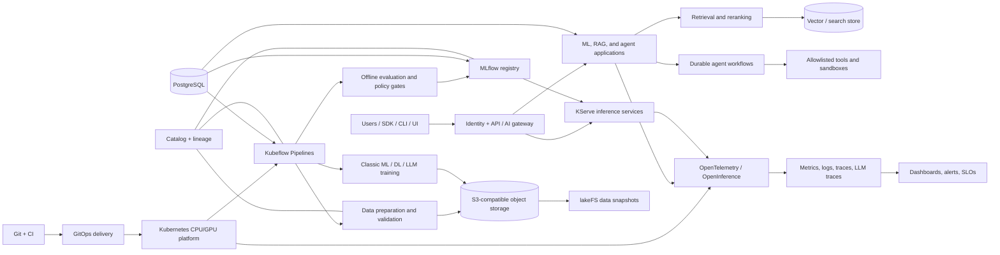

# Fully Open-Source ML/LLM Platform: Implementation Plan

Status: architecture blueprint  
Last reviewed: 2026-08-07  
Scope: study-first, self-hosted classic ML, deep learning, foundation models, RAG, and bounded agentic applications, with production architecture retained as an advanced learning target

Atomic execution backlog: [`issues/INDEX.md`](issues/INDEX.md)

## 1. Goal and interpretation

Build a vendor-neutral platform whose control plane, data plane, and operational tooling can all run from source on infrastructure the organization controls. It must support:

- classic batch and online ML (scikit-learn, XGBoost, LightGBM, CatBoost);
- deep learning and distributed training (primarily PyTorch);
- LLM evaluation, parameter-efficient fine-tuning, and serving;
- reproducible RAG ingestion, indexing, retrieval, reranking, and evaluation;
- durable, observable agents with explicit tools, limits, and human approval;
- local development, a single shared development cluster, and production Kubernetes;
- CPU and GPU workloads without making GPUs a prerequisite for the basic platform.

The primary purpose is **studying and exploration**. Production-grade concerns remain in the plan because reliability, security, governance, economics, and operations are part of understanding a modern platform, but they should usually be implemented as small simulations before they are deployed at scale. A local implementation that demonstrates a concept correctly is more valuable here than a large cluster that hides it.

“All software solutions” below means a comprehensive practical shortlist by capability, not every project that has ever existed. Adopt one default per capability. Alternatives are escape hatches, not a request to install everything.

## 2. Non-negotiable design rules

1. **Open-source boundary:** every required deployed component must use an OSI-approved license. Commercial support may be purchased, but production must not depend on a proprietary control plane or feature.
2. **Models and data are separate:** open-source platform software does not make model weights or datasets open source. Record and enforce the license, acceptable-use terms, provenance, and redistribution policy for each.
3. **Artifact-first reproducibility:** every run records Git commit, immutable image digest, data snapshot/commit, configuration, dependencies, random seeds, metrics, environment, and output artifact URIs.
4. **One object namespace:** datasets, pipeline artifacts, model files, adapters, evaluation sets, and reports use S3-compatible object storage with explicit prefixes and retention rules.
5. **Containers are the execution contract:** local code may be flexible, but shared pipelines, training, indexing, evaluation, and serving run in immutable OCI images.
6. **APIs before UIs:** every action available in a UI must be reproducible through code or a declarative API.
7. **GitOps after bootstrap:** cluster and application changes flow through reviewed Git commits and reconciliation.
8. **Open standards at boundaries:** OCI, S3, Kubernetes APIs, OpenTelemetry/OTLP, OpenInference, OpenLineage, OpenAPI, Parquet/Iceberg, and KServe inference protocols where applicable.
9. **Evaluation gates deployment:** no model, prompt, retriever, index, or agent moves to production solely because a pipeline completed.
10. **Agent least privilege:** tools are allowlisted, credentials are scoped, execution is sandboxed, steps and cost are bounded, and risky effects require approval.
11. **Learn by comparison:** for important abstractions, implement one small baseline without a framework, then compare it with one or two frameworks using the same dataset and evaluation harness.
12. **Scale only after measurement:** local CPU, one GPU, and single-node Kubernetes are valid endpoints. Distributed components are experiments until a measured limit justifies them.

## 3. Target architecture



### Logical planes

- **Foundation plane:** Kubernetes, networking, storage, PostgreSQL, identity, secrets, registry, policy, GitOps, backups.
- **Data plane:** connectors, object storage, Parquet/Iceberg, validation, transformation, catalog, lineage, versioning, optional feature store.
- **ML control plane:** notebooks/SDK, pipelines, training jobs, experiment tracking, registry, evaluation, deployment promotion.
- **Inference plane:** model runtimes, autoscaling, batch inference, gateways, caching, traffic splitting.
- **GenAI plane:** document ingestion, embeddings, search, reranking, prompts, RAG, agent state, tools, safety and evaluation.
- **Operations plane:** infrastructure/app/model/LLM telemetry, drift, incidents, audit, cost, security, and disaster recovery.

### Study-first operating profiles

Use profiles rather than one always-on installation. Each profile introduces only enough infrastructure to expose the concept being studied.

| Profile | Runs where | Purpose | Typical components |
|---|---|---|---|
| A — Python lab | Native virtual environment | Algorithms, metrics, data leakage, feature engineering, model internals | Jupyter/marimo, uv, scikit-learn/PyTorch, DuckDB/Polars, pytest |
| B — Local ML platform | Compose on a laptop/workstation | Service boundaries, artifacts, tracking, registry, APIs, telemetry, basic RAG | PostgreSQL/pgvector, MLflow, local S3-compatible store, FastAPI, Prometheus/Grafana, Phoenix or Langfuse |
| C — Kubernetes lab | kind/k3d/K3s or one small server | Containers, scheduling, pipelines, GitOps, KServe, identity, policy | Kubernetes, Argo CD, KFP, KServe, Keycloak, lightweight storage |
| D — Accelerator lab | One or more GPU workstations/nodes | Fine-tuning, quantization, batching, distributed training/inference, GPU telemetry | PyTorch, PEFT/TRL, vLLM/SGLang, Kubeflow Trainer, Kueue, DCGM |
| E — Production simulation | Multi-node disposable cluster | HA, tenancy, upgrades, failure injection, backup/restore, quotas, cost | Rook/Ceph, CloudNativePG, OpenBao, policy stack, full observability |

Profiles A and B are the default. Keep C–E reproducible but shut them down when they are not part of the current experiment. Every substantial topic should produce a notebook or executable example, an automated test/evaluation, a short comparison report, and a captured run manifest.

## 4. Recommended paved road

Use this stack unless an architecture decision record (ADR) justifies a change.

| Capability | Default | Why / adoption boundary |
|---|---|---|
| Local environment | uv + Jupyter/marimo, then Docker or Podman Compose and `kind`/`k3d` | Begin with transparent Python experiments, then add service and cluster boundaries. Do not reproduce production HA locally. |
| Cluster | Kubernetes; RKE2 or kubeadm for self-managed production | Common substrate for CPU/GPU scheduling and ecosystem portability. |
| Packaging / GitOps | Helm + Kustomize + Argo CD | Declarative, reviewable environments and rollback. |
| Infrastructure as code | OpenTofu + Ansible | Open Terraform-compatible provisioning plus host bootstrap. |
| Source control / CI | Forgejo + Woodpecker CI; Tekton when cluster-native CI is needed | Fully self-hosted default. GitLab CE is a larger alternative. |
| OCI registry / supply chain | Harbor + BuildKit + Syft + Grype/Trivy + Cosign | Images, charts, signatures, SBOMs, and vulnerability gates. |
| Identity | Keycloak | OIDC/SAML, groups, service identities; connect all UIs to one IdP. |
| Secrets | OpenBao + External Secrets Operator | Avoid secrets in Git and inject short-lived/scoped credentials. |
| Network / policy | Cilium, cert-manager, Gateway API, Kyverno | Networking, TLS, isolation, and admission policy. Keep a service mesh optional. |
| Object/block/file storage | Rook + Ceph in production; local filesystem or Garage/SeaweedFS for small development | Ceph offers S3-compatible object, block, and file storage. Do not make archived MinIO CE a new production dependency. |
| Metadata databases | PostgreSQL operated by CloudNativePG | Shared operational primitive, but separate databases/users/backups per service. |
| Data file/table format | Parquet first; Apache Iceberg when transactional tables/catalog semantics are needed | Start simple; add lakehouse complexity only when justified. |
| Data versioning | lakeFS for shared object data; DVC for small Git-centric projects | Immutable Git-like dataset snapshots; persist its commit ID in MLflow. |
| Local data prep | Polars + DuckDB + Pandera | Fast, small-footprint, testable Python/SQL transformations. |
| Distributed data prep | Apache Spark; Ray Data for Python/ML-native or GPU-adjacent flows | Add only after local tools no longer meet measured scale/SLA. |
| Data quality | Great Expectations or Soda Core; Pandera in libraries | Pipeline gates plus lightweight schema checks close to code. Pick one platform-level suite. |
| Catalog / governance / lineage | OpenMetadata + OpenLineage | Ownership, discovery, schema, quality, and end-to-end lineage. |
| Workflow orchestration | Kubeflow Pipelines standalone | Containerized, portable ML DAGs. Avoid the entire Kubeflow bundle initially. |
| Training jobs | Kubernetes Jobs initially; Kubeflow Trainer for distributed jobs | One-node workloads stay simple; use Trainer for multi-node/GPU frameworks. |
| Queue / quotas | Kueue | Admission, quotas, cohorts, and fair sharing for expensive batch/GPU jobs. |
| Experiment tracking / model registry | MLflow backed by PostgreSQL and object storage | One lifecycle record for classic ML and LLM runs, datasets, metrics, and models. |
| Hyperparameter optimization | Optuna first; Katib or Ray Tune at distributed scale | Keep search logic portable and observable. |
| Feature store | Feast, only for repeated online/offline features | Do not install until an online-feature use case proves the need. |
| Classic/deep training | scikit-learn, XGBoost, LightGBM, CatBoost; PyTorch | Broad algorithm coverage with a Python-first contract. Export ONNX when useful. |
| LLM adaptation | Transformers + Datasets + Accelerate + PEFT + TRL; DeepSpeed/FSDP when needed | Start with LoRA/QLoRA and small models; full fine-tuning is a late optimization. |
| Serving control plane | KServe | One Kubernetes API for predictive and generative serving, revisions, scaling, and routing. |
| Classic model runtime | MLServer or KServe framework runtimes; Triton for optimized multi-framework GPU inference | Start portable; introduce Triton only for measured performance needs. |
| LLM runtime | vLLM; llama.cpp for edge/CPU development; SGLang as benchmarked alternative | OpenAI-compatible API and efficient batching/caching. Choose by benchmark, not fashion. |
| Application API | FastAPI + Pydantic | Explicit typed contract around predictions, RAG, and agent runs. |
| Vector/search store | PostgreSQL + pgvector first; Qdrant when vector scale/latency demands it; OpenSearch when lexical search is equally central | Avoid a new distributed database until requirements justify it. |
| RAG composition | Haystack for explicit indexing/query pipelines; use LlamaIndex if document/retriever integrations dominate | Select one per product; keep retrieval interfaces framework-neutral. |
| Agent orchestration | Explicit state machines; LangGraph OSS for graph workflows; Temporal for long-running durable business processes | Do not start with unconstrained multi-agent autonomy. |
| Agent state/cache/queue | PostgreSQL + Valkey; NATS JetStream or Apache Kafka only when durable event streaming is needed | Reuse simple primitives before adding distributed messaging. |
| Prompts / LLM traces / eval UI | Langfuse OSS **or** Phoenix, not both initially | Langfuse emphasizes prompt/trace operations; Phoenix emphasizes trace-driven evaluation and experiments. Both accept open telemetry patterns. |
| Evaluation libraries | scikit-learn metrics + Evidently; Ragas + DeepEval + Promptfoo for RAG/LLM/agent tests | Combine deterministic, task, retrieval, model-judge, safety, and human evaluation. |
| Platform observability | OpenTelemetry Collector + Prometheus + Alertmanager + Loki + Tempo + Grafana | One vendor-neutral signal path for metrics, logs, and traces. |
| ML monitoring | Evidently + custom Prometheus metrics; Alibi Detect for specialized drift/outlier tests | Monitor input/output quality and delayed ground-truth performance. |
| GPU telemetry | NVIDIA DCGM Exporter | Utilization, memory, thermals, errors; AMD device metrics if using ROCm. |
| Cost / efficiency | OpenCost + kube-state-metrics; Kepler optionally | Attribute CPU/GPU/storage spend or capacity to team, model, endpoint, and run. |
| Backups / recovery | Velero + pgBackRest/Barman + Ceph snapshots/object replication | Restore tests are part of the release process. |

## 5. Practical open-source solution catalog

This is the evaluation catalog. Items are alternatives unless shown as defaults above. Before adoption, verify the exact version's license, maintenance status, security history, portability, and which features are enterprise-only.

| Area | Practical candidates |
|---|---|
| Kubernetes distributions | kubeadm, RKE2, K3s, OKD, Talos Linux, MicroK8s, kind, k3d |
| Cluster provisioning | OpenTofu, Crossplane, Cluster API, Ansible, Kubespray |
| Git / CI | Forgejo, Gitea, GitLab CE, Woodpecker CI, Jenkins, Tekton, Zuul |
| GitOps / releases | Argo CD, Flux, Helm, Kustomize, Carvel, Argo Rollouts, Flagger |
| OCI registries | Harbor, CNCF Distribution, Zot Registry, Quay Community |
| Build systems | BuildKit, Buildah, Podman, Kaniko alternatives based on BuildKit, Bazel, Nix |
| Identity / access | Keycloak, Dex, Ory Kratos/Hydra, Authelia; Kubernetes RBAC |
| Secrets / keys | OpenBao, SOPS + age, Sealed Secrets, External Secrets Operator, cert-manager |
| Policy / isolation | Kyverno, OPA Gatekeeper, Cilium NetworkPolicy, gVisor, Kata Containers, Firecracker, Falco |
| Storage | Ceph/Rook, Garage, SeaweedFS, OpenStack Swift, GlusterFS; MinIO only with an explicit maintenance-risk ADR |
| Relational / cache | PostgreSQL, CloudNativePG, Patroni, Valkey, Dragonfly |
| Messaging / streaming | Apache Kafka, Apache Pulsar, NATS JetStream, RabbitMQ, Apache Flink |
| Batch/CDC ingestion | Meltano/Singer, Apache NiFi, Apache SeaTunnel, Debezium, Kafka Connect, dlt |
| File/table formats | Parquet, Arrow, Avro, ORC; Apache Iceberg, Delta Lake, Apache Hudi |
| Catalogs for table formats | Apache Polaris, Project Nessie, Gravitino, Hive Metastore |
| Dataset/data versioning | lakeFS, DVC, Git LFS, Pachyderm Community where its license/features fit, Iceberg snapshots |
| Local transformation | Polars, pandas, DuckDB, dbt Core, SQLMesh, Ibis |
| Distributed transformation | Apache Spark, Ray Data, Dask, Apache Beam, Flink |
| Validation / profiling | Great Expectations, Soda Core, Pandera, Deequ, whylogs, ydata-profiling |
| Metadata / catalog | OpenMetadata, DataHub, Apache Atlas, Amundsen |
| Lineage | OpenLineage + Marquez, OpenMetadata lineage, DataHub lineage, Spline |
| Labeling / annotation | Label Studio Community, CVAT, Argilla, doccano |
| Privacy / PII | Microsoft Presidio, scrubadub, Apache Ranger for data authorization |
| Workflow engines | Kubeflow Pipelines, Flyte, Argo Workflows, Apache Airflow, Dagster OSS, Prefect OSS, Metaflow, ZenML OSS |
| Distributed training operators | Kubeflow Trainer, Ray Train, Volcano Jobs, MPI Operator |
| Schedulers / quotas | Kueue, Volcano, Apache YuniKorn, Slurm (especially existing HPC) |
| Notebooks / workspaces | JupyterLab, JupyterHub, Kubeflow Notebooks, code-server, Theia |
| Package / environment management | uv, pip-tools, Poetry, Conda/Mamba, Nix, PEX |
| Configuration / reproducibility | Hydra, OmegaConf, Pydantic Settings, gin-config, Sacred; lockfiles and run manifests |
| EDA / interactive applications | JupyterLab, marimo, Streamlit, Gradio, Panel, Voilà, Plotly, Altair, Bokeh |
| Dataset exploration / benchmarks | OpenML, Hugging Face Datasets, TensorFlow Datasets, TorchVision datasets; always review individual dataset licenses |
| Experiment tracking | MLflow, ClearML Community, Aim, Sacred + Omniboard, Guild AI |
| Model registries | MLflow Model Registry, Kubeflow Model Registry, Harbor/OCI artifacts, ML Metadata |
| Feature stores | Feast, Hopsworks Community, Feathr |
| HPO / AutoML | Optuna, Ray Tune, Katib, Hyperopt, FLAML, AutoGluon, auto-sklearn |
| Classic ML | scikit-learn, XGBoost, LightGBM, CatBoost, statsmodels, River, Vowpal Wabbit |
| Deep learning | PyTorch, JAX, TensorFlow/Keras, Lightning, DeepSpeed, Horovod |
| Specialized ML domains | time series: statsmodels, sktime, Darts, GluonTS, StatsForecast/NeuralForecast; recommenders: implicit, LightFM, RecBole; graph ML: PyTorch Geometric, DGL; causal: DoWhy, EconML; reinforcement learning: Gymnasium, Stable-Baselines3, Ray RLlib |
| Computer vision / audio / NLP | TorchVision, timm, OpenCV, Kornia; torchaudio, librosa, Whisper tooling; spaCy, Transformers, sentence-transformers |
| Interpretability / fairness | SHAP, LIME, Captum, InterpretML, Fairlearn, AIF360, model cards and slice-based evaluation |
| Active learning / weak supervision | small-text, modAL forks after maintenance review, Snorkel, Label Studio/Argilla feedback loops |
| Synthetic data | Faker, Mimesis, DataDreamer/distilabel-style LLM pipelines; SDV Community is BSL/source-available and needs an explicit exception rather than being assumed open source |
| Model interchange / optimization | ONNX, ONNX Runtime, OpenVINO, Apache TVM, TensorRT components where licensing is acceptable |
| Edge / browser inference | ONNX Runtime Mobile/Web, TensorFlow Lite, ExecuTorch, llama.cpp, WebGPU, Apache TVM, OpenVINO |
| Pretraining at educational scale | nanoGPT, LitGPT, minGPT-style implementations, TorchTitan; Megatron-LM/DeepSpeed for studying large-scale parallelism |
| LLM training / adaptation | Transformers, Datasets, Accelerate, PEFT, TRL, torchtune, Axolotl, LLaMA-Factory, DeepSpeed, PyTorch FSDP |
| LLM post-training / alignment | TRL for SFT/reward modeling/DPO-family methods; verl, OpenRLHF, OpenRL and Ray RLlib for advanced RL-based post-training; independently evaluate algorithms, reward hacking, and framework maturity |
| Compression / quantization | torchao, bitsandbytes, GPTQModel, AutoAWQ-compatible tooling, AWQ/GPTQ/GGUF formats, llm-compressor, ONNX quantization; pruning and knowledge distillation experiments |
| Model/embedding catalogs | Hugging Face Hub clients, ModelScope, MLflow artifacts, OCI artifacts; self-hosted Git/LFS/object storage |
| Classic serving | KServe, MLServer, Seldon Core, BentoML, Ray Serve, Triton, TensorFlow Serving, TorchServe alternatives |
| LLM serving | vLLM, SGLang, llama.cpp, Ollama for development, LocalAI, Triton backends |
| Distributed LLM inference | vLLM/SGLang tensor and pipeline parallelism, llm-d, KServe LLMInferenceService, Ray Serve; study prefix-aware routing and prefill/decode disaggregation only after single-server baselines |
| API / AI gateways | Envoy Gateway/AI Gateway, Apache APISIX, Kong Gateway OSS, Higress, Traefik; LiteLLM only after license/edition review |
| Inference optimization concepts | continuous/dynamic batching, paged KV cache, prefix caching, speculative decoding, quantization, structured decoding, model routing, semantic/exact caching, prefill/decode disaggregation |
| Vector/search engines | pgvector, Qdrant, Milvus, Weaviate OSS, OpenSearch, Vespa, Valkey vector search, FAISS (library), hnswlib (library) |
| Document parsing / OCR | Apache Tika, Docling, Unstructured OSS, Tesseract, OCRmyPDF, PaddleOCR, PyMuPDF |
| Embeddings / rerankers | Sentence Transformers, FlagEmbedding/BGE tooling, FastEmbed, Infinity, Text Embeddings Inference; independently review weight licenses |
| RAG frameworks | Haystack, LlamaIndex, LangChain, txtai, DSPy, RAGFlow, GraphRAG implementations |
| Graph / structured retrieval | Apache AGE/PostgreSQL, NetworkX, RDFLib, Apache Jena, OpenSearch, SQL engines; Microsoft GraphRAG and framework graph retrievers; review graph-database edition licenses carefully |
| Multimodal RAG | Docling/Unstructured, OCR, table/layout extraction, image/audio embeddings, OpenCLIP, ColPali-style retrieval, late-interaction and multimodal rerankers; model licenses vary |
| Agent frameworks | LangGraph OSS, Haystack Agents, LlamaIndex Workflows, Microsoft Agent Framework/AutoGen, CrewAI OSS, Semantic Kernel, PydanticAI, smolagents |
| Durable agent workflows | Temporal, Restate, DBOS, Apache Airflow/Dagster for noninteractive jobs |
| Tool standards / execution | MCP SDKs, OpenAPI, JSON Schema, Kubernetes Jobs, gVisor/Kata sandboxes, Jupyter kernels |
| Guardrails / content safety | NeMo Guardrails, Guardrails AI, LLM Guard, Presidio, custom deterministic policy, OPA |
| Multimodal generation | Diffusers, ComfyUI, InvokeAI, Stable Audio/OpenVoice-style tooling, image/video/audio model runtimes; each model has separate weight and content restrictions |
| Federated / privacy-preserving ML | Flower, PySyft/OpenMined tooling, Opacus, TensorFlow Privacy, PipelineDP, Microsoft SEAL; include attack and privacy-budget experiments |
| ML evaluation / monitoring | Evidently, Alibi Detect, NannyML OSS, whylogs, Deepchecks OSS, Giskard OSS, Fairlearn, AIF360 |
| LLM/RAG/agent evaluation | Ragas, DeepEval, Promptfoo, Phoenix, Langfuse, TruLens, Giskard, Inspect AI, lm-evaluation-harness |
| Telemetry | OpenTelemetry, OpenInference, Prometheus, Alertmanager, Grafana, Loki, Tempo, Jaeger, OpenSearch, VictoriaMetrics |
| Load / inference benchmarking | k6, Locust, wrk2, Vegeta, MLPerf Inference, GenAI-Perf, vLLM benchmark tools |
| Security / supply chain | Sigstore Cosign, Syft, Grype, Trivy, FOSSology, ScanCode, ORT, Falco, Tetragon |
| Backup / DR | Velero, pgBackRest, Barman, Restic, Ceph snapshots/replication |
| Cost / energy | OpenCost, Kepler, kube-state-metrics, DCGM Exporter |
| Product experimentation | Flipt or Unleash OSS for feature flags, custom consistent-hash A/B assignment, PostgreSQL/ClickHouse for outcomes, statistical notebooks for analysis |
| Developer portal / docs | Backstage, MkDocs Material, Docusaurus, OpenAPI/Swagger, AsyncAPI |

### Tools deliberately not assumed to be fully open source

- Do not equate “free,” “source available,” or “self-hostable” with open source. Re-check BSL, SSPL, Elastic License, and custom feature licenses.
- HashiCorp Vault and Terraform releases after their license changes are not the defaults; OpenBao and OpenTofu are.
- Managed clouds and proprietary experiment/observability control planes may integrate through open protocols, but cannot be required for operation.
- MinIO's public community repository is archived as of 2026; it remains inspectable under its historical license but is not the default for a new production platform.

### Modern ML/LLM coverage curriculum

The platform is complete as a study environment when it can host or document each of these experiments. These are learning tracks, not mandatory always-on services.

| Domain | Questions to explore | Minimum practical experiment |
|---|---|---|
| Statistical learning foundations | bias/variance, regularization, calibration, uncertainty, leakage, imbalance, cross-validation | Compare linear, tree, boosting, and calibrated models on one tabular dataset with slice metrics and confidence intervals. |
| Data-centric ML | schema errors, missingness, duplicates, label noise, contamination, dataset shift, data valuation | Introduce controlled data defects, measure their effects, and compare cleaning/relabeling against changing the model. |
| HPO / AutoML | search spaces, Bayesian/evolutionary optimization, early stopping, nested validation, compute fairness | Compare manual tuning, Optuna, and one AutoML system under the same time/compute budget. |
| Unsupervised / representation learning | clustering, dimensionality reduction, anomaly detection, self-supervision | Compare PCA/UMAP plus clustering and an autoencoder; evaluate stability rather than only plotting results. |
| Time series | temporal splits, seasonality, covariates, probabilistic forecasts, backtesting | Backtest statistical and neural forecasts without future leakage; monitor interval coverage. |
| Recommenders / ranking | candidate generation, retrieval, ranking, implicit feedback, counterfactual bias | Build a two-stage recommender and evaluate recall@k, nDCG, diversity, novelty, and latency. |
| Causal ML | interventions versus prediction, propensity, heterogeneous treatment effects | Reproduce a synthetic-treatment experiment with DoWhy/EconML and sensitivity checks. |
| Online / streaming ML | incremental updates, concept drift, delayed labels, replay | Train a River model on an evolving stream, detect drift, compare reset/window/update strategies. |
| Reinforcement learning | environment design, exploration, offline/online RL, reward misspecification | Train a small Gymnasium agent, checkpoint it, and demonstrate one reward-hacking failure. |
| Computer vision / audio | augmentation, transfer learning, multimodal encoders, data labeling | Fine-tune a small vision or audio model and trace dataset/version/augmentation effects. |
| Foundation-model pretraining | tokenization, objectives, scaling, data mixtures, parallelism, checkpointing | Train a tiny transformer from scratch, measure scaling behavior, and resume from a checkpoint. |
| Supervised fine-tuning | instruction data quality, packing, masking, LoRA/QLoRA, catastrophic forgetting | Fine-tune a small model with PEFT and compare base versus adapter on task and general evaluations. |
| Preference optimization | reward/preference data, DPO-family algorithms, judge bias | Run a tiny DPO/ORPO-style experiment and audit preference quality and regressions. |
| RL post-training | rollout engines, reward models/verifiers, PPO/GRPO-family algorithms, reward hacking | Use TRL or verl on a toy verifiable task with strict resource limits; inspect trajectories and reward exploitation. |
| Model compression | quantization, pruning, distillation, low-rank approximation | Compare FP16/BF16, 8-bit, 4-bit, and GGUF/CPU variants on quality, memory, TTFT, and throughput. |
| ML compilers / kernels | graphs/IRs, fusion, code generation, hardware-specific kernels | Export one model through ONNX and optimize with ONNX Runtime or TVM; profile operators before and after. |
| Single-node inference | batching, caching, streaming, structured decoding, concurrency | Benchmark vLLM/SGLang/llama.cpp under controlled request-length and concurrency distributions. |
| Distributed inference | parallelism, routing, KV-cache locality, disaggregated prefill/decode | Simulate or deploy a small llm-d/KServe setup and compare it to the single-server baseline. |
| Basic RAG | parsing, chunks, embeddings, filters, hybrid retrieval, reranking, citations | Build a versioned corpus and evaluate retrieval separately from generation. |
| Advanced RAG | query rewriting, multi-query, late interaction, contextual retrieval, long context | Run ablations against the same golden set; keep only changes with statistically meaningful gains. |
| Graph / structured RAG | entity extraction, ontology, graph traversal, SQL/text-to-SQL, provenance | Compare vector RAG with an Apache AGE/NetworkX graph or SQL retriever on relationship-heavy questions. |
| Multimodal RAG | layout, tables, images, scanned PDFs, audio/video segments | Answer questions over a document containing prose, a table, and an image with source-level citations. |
| Prompt / context engineering | templates, structured outputs, few-shot selection, memory, caching | Version prompts as artifacts and test schema conformance, quality, latency, and cache behavior. |
| Agents | routing, planning, tools, memory, durable state, human approval, multi-agent tradeoffs | Build a bounded single agent first; compare a deterministic workflow and multi-agent variant on the same task set. |
| Agent protocols | MCP/OpenAPI/JSON Schema, discovery, authentication, delegation | Expose one read-only tool through MCP, trace authorization, and fuzz malformed/untrusted tool results. |
| Multimodal generation | diffusion/flow concepts, conditioning, safety, provenance | Run a small image/audio generation pipeline with prompt/version/seed tracking and content policy checks. |
| Synthetic data / weak supervision | fidelity, privacy, coverage, label functions, contamination | Generate a small synthetic dataset, quantify utility/privacy risks, and compare against a simple Faker baseline. |
| Active learning / human feedback | sampling strategies, annotation agreement, adjudication | Close a label-train-error-analysis-relabel loop and measure label efficiency. |
| Federated / private ML | non-IID clients, secure aggregation, differential privacy, privacy budgets | Simulate federated training with Flower and compare accuracy/privacy/communication tradeoffs using Opacus where applicable. |
| Robustness / responsible AI | distribution shift, fairness, explainability, uncertainty, red teaming | Create model and system cards, adversarial tests, slice reports, and an explicit abstention policy. |
| Product experimentation | shadowing, canaries, A/B tests, feedback bias, sequential testing | Assign stable cohorts, log exposure before outcomes, and analyze both quality and guardrail metrics. |
| Platform engineering | multi-tenancy, scheduling, supply chain, observability, cost, DR | Recreate the lab from code, inject a failure, restore it, and attribute resource use to a run. |

For every comparison, pin the dataset and workload, warm up runtimes, repeat measurements, report uncertainty, and retain raw results. A benchmark without workload shape, hardware/software versions, and correctness checks is not evidence.

## 6. End-to-end lifecycle contracts

### 6.1 Universal run manifest

Every data, training, indexing, evaluation, and deployment run emits a machine-readable manifest containing:

- `run_id`, owner, project, environment, timestamps, parent run, and correlation/trace IDs;
- Git repository and commit; dirty-worktree flag for local runs;
- source and output image digests plus SBOM and signature references;
- input/output artifact URIs, checksums, schemas, lakeFS commit or table snapshot IDs;
- model name/version/license, tokenizer, embedding model, prompt version, and index version where applicable;
- dependency lockfile hash, hardware, driver/runtime versions, and random seeds;
- parameters, metrics, evaluation results, policy decisions, and approval identity;
- lineage events and retention/security classification.

Store searchable run metadata in MLflow/OpenMetadata, bulky artifacts in object storage, and operational traces through OpenTelemetry.

### 6.2 Classic ML path

`ingest -> validate -> snapshot -> transform -> split -> train -> evaluate -> explain/fairness checks -> register -> approve -> canary/shadow -> monitor -> retrain or rollback`

Required gates: schema/data quality, leakage checks, reproducibility, baseline comparison, slice metrics, latency/resource benchmark, model card, signature/SBOM, and rollback test.

### 6.3 RAG path

`source -> parse/OCR -> classify/redact -> normalize -> chunk -> validate -> embed -> index -> retrieve -> rerank -> generate with citations -> offline eval -> shadow/canary -> online feedback`

Version the source snapshot, parser/chunker, chunk schema, embedding model, vector index configuration, retriever, reranker, prompt, generator, and evaluation set independently. Never update a production index in place; build a versioned index and atomically switch an alias.

Minimum RAG metrics: ingestion failures, document/chunk coverage, duplicate rate, retrieval recall@k/MRR/nDCG, context precision/recall, groundedness/faithfulness, answer correctness, citation validity, abstention quality, latency by stage, token use, and cost/capacity proxy.

### 6.4 Agent path

`request -> authenticate/authorize -> plan or route -> policy check -> tool call -> validate result -> checkpoint -> repeat within budget -> human approval for risky effects -> final response -> evaluate/audit`

Each agent has a typed state schema, allowed tools, per-tool scopes, maximum steps/time/tokens, retry policy, idempotency key, checkpoint store, cancellation path, and compensation/rollback behavior. Treat all retrieved content and tool output as untrusted data. Browser, shell, code execution, email, payments, infrastructure changes, and record deletion must be separately sandboxed and authorized.

## 7. Phased implementation roadmap

Each phase is intentionally a bounded implementation packet suitable for a smaller coding model. Phases 0–6 form the main integration sequence; later phases and the exploration branches can be taken in the order that matches the current study topic. Exit criteria are learning checkpoints: automate them before treating the result as a reusable platform capability, but a disposable notebook experiment does not need enterprise hardening.

### Phase 0 — Scope, contracts, and local vertical slice

Deliver:

- ADR template, supported use-case matrix, SLO vocabulary, threat model, license policy, naming/tagging conventions;
- repository skeleton, Python package standards, pre-commit hooks, unit tests, Make/Task targets;
- Compose-based local stack: PostgreSQL, lightweight S3-compatible storage, MLflow, Prometheus/Grafana;
- one tiny sklearn train/register/serve example with a run manifest.

Exit: a clean checkout can execute one command to train, register, serve, query, and observe a model; repeated runs are attributable and reproducible.

### Phase 1 — Kubernetes foundation

Deliver:

- development Kubernetes cluster; namespaces for platform services and isolated projects;
- ingress/Gateway API, DNS, TLS, default-deny network policies, quotas/limits;
- PostgreSQL operator, development object storage, OCI registry;
- backup targets and a first restore drill.

Exit: destroy/recreate the development cluster from code, restore state, and pass smoke tests.

### Phase 2 — Identity, secrets, GitOps, and supply chain

Deliver:

- Keycloak OIDC, groups mapped to Kubernetes and application roles;
- OpenBao/External Secrets, credential rotation, no plaintext secrets in Git;
- Forgejo/CI and Argo CD promotion across dev/stage/prod overlays;
- signed images, SBOM generation, vulnerability/license policies, admission verification.

Exit: an unauthorized user cannot access project data or deploy; an unsigned or policy-failing image is rejected; every deployed digest maps to a reviewed commit.

### Phase 3 — Versioned data foundation

Deliver:

- object namespace/bucket layout, encryption, lifecycle and retention rules;
- lakeFS integrated with object storage; Parquet dataset conventions;
- Polars/DuckDB transforms, chosen validation framework, test fixtures;
- OpenMetadata/OpenLineage integration and optional Iceberg proof of concept.

Exit: ingest, validate, commit, transform, trace lineage, reproduce an old snapshot, and reject bad data automatically.

### Phase 4 — Repeatable ML pipelines

Deliver:

- Kubeflow Pipelines standalone with reusable components for snapshot, validate, transform, train, evaluate, register;
- MLflow with PostgreSQL metadata and object artifacts;
- pipeline caching rules, retries/timeouts, notifications, run-manifest propagation;
- baseline sklearn/XGBoost pipeline and scheduled batch inference.

Exit: the same pipeline runs locally on fixtures and remotely on Kubernetes; promotion requires evaluation thresholds; outputs trace back to inputs and code.

### Phase 5 — Model serving and safe delivery

Deliver:

- KServe, a standard prediction schema, FastAPI application facade;
- health/readiness, request IDs, timeouts, payload limits, autoscaling, batch endpoint;
- canary/shadow routing, rollback, load tests, model warmup and capacity report;
- registry-to-deployment reconciler or GitOps promotion record.

Exit: deploy two versions, shadow/canary traffic, observe them separately, trigger rollback, and prove no request contract break.

### Phase 6 — Production model observability

Deliver:

- OpenTelemetry instrumentation; Prometheus/Loki/Tempo/Grafana dashboards and alerts;
- service SLOs for availability, error rate, p50/p95/p99 latency, saturation;
- feature/prediction summaries, drift checks, slice metrics, delayed ground-truth joins;
- model incident playbook, feedback capture, retraining trigger policy.

Exit: a synthetic drift/performance incident alerts with model/data/version context and links to a usable runbook.

### Phase 7 — GPU and distributed training

Deliver:

- GPU node pool, device plugin/operator, runtime compatibility matrix, DCGM telemetry;
- Kueue quotas/fair sharing and priority policy; Kubeflow Trainer runtimes;
- PyTorch distributed smoke test, checkpoint/resume, node-failure behavior;
- utilization and cost/capacity dashboard.

Exit: a queued multi-GPU job trains, checkpoints, resumes after interruption, records topology, and stays within team quota.

### Phase 8 — LLM serving and adaptation

Deliver:

- approved model/license catalog and weight provenance manifest;
- vLLM endpoint behind the common gateway, streaming and quotas, tokenizer-aware limits;
- Transformers/PEFT/TRL LoRA pipeline, adapter registry, offline safety/task evals;
- benchmark matrix by model/runtime/quantization/hardware: quality, TTFT, inter-token latency, throughput, memory, concurrency.

Exit: reproduce a small adapter, evaluate it against the base model, register both, deploy via immutable digest, and roll back.

### Phase 9 — RAG version 1

Deliver:

- one source connector and one document type; parsing/OCR, redaction, deterministic chunking;
- pgvector, embedding service, indexing pipeline, metadata/ACL filters;
- hybrid retrieval where needed, reranking, cited answers, abstention behavior;
- golden evaluation set and stage-by-stage tracing.

Exit: rebuilding from the same inputs produces an equivalent versioned index; citations resolve to permitted source chunks; regression gates cover retrieval and answer quality.

### Phase 10 — RAG scale and lifecycle

Deliver only when measurements justify them:

- CDC/incremental indexing, tombstones, deduplication, backpressure, index aliases;
- Qdrant/OpenSearch/Milvus evaluation against pgvector using representative scale and filters;
- tenant isolation, backup/restore, re-embedding migration, cache strategy;
- online feedback joined to trace/index/prompt/model versions.

Exit: zero-downtime index migration and a restore test meet the stated recovery objectives; the chosen database wins a documented benchmark.

### Phase 11 — Bounded agentic workflows

Deliver:

- typed single-agent state machine, tool registry, JSON-schema validation, scoped credentials;
- durable checkpoints/cancellation, idempotency, step/time/token budgets;
- human approval queue and audit record for side effects;
- sandboxed code/browser execution if required; prompt-injection and data-exfiltration tests;
- task success, tool accuracy, trajectory, policy violation, latency, and resource evals.

Exit: agents recover from interruption, cannot call unapproved tools or exceed budgets, and cannot perform a high-risk side effect without recorded approval.

### Phase 12 — Multi-tenancy, governance, and operations hardening

Deliver:

- per-team projects, quotas, network/storage isolation, chargeback/showback, deletion/export workflows;
- HA for required stateful services, upgrades, capacity plan, chaos and DR tests;
- catalog ownership, dataset/model/prompt cards, approval/audit retention;
- platform API/CLI, golden templates, developer portal/docs, support and deprecation policy.

Exit: onboard a new team without manual cluster-admin work; complete upgrade and regional/site recovery rehearsals within defined SLO/RPO/RTO.

### Optional exploration branches

These branches attach to the core roadmap without forcing permanent infrastructure.

#### Branch A — Algorithms beyond standard supervised ML

- Add one reproducible project each for time-series forecasting, recommenders/ranking, anomaly detection, online learning, causal inference, graph ML, and reinforcement learning.
- Reuse MLflow, data snapshots, evaluation reports, and serving contracts so the differences are in learning behavior rather than platform plumbing.
- Include naive/statistical baselines; specialized models must beat them on predeclared metrics.

Exit: each project has a leakage-safe split/backtest, baseline comparison, model card, and small serving or batch-inference demonstration.

#### Branch B — Foundation-model internals and pretraining

- Implement a tokenizer and tiny transformer educationally before using a large framework.
- Study data mixture/deduplication, training objectives, initialization, optimizers/schedules, mixed precision, gradient accumulation/checkpointing, and scaling curves.
- Progress from one device to data/tensor/pipeline/context parallelism with TorchTitan, DeepSpeed, or Megatron-style tooling only where hardware permits.

Exit: train and resume a tiny model from scratch; explain its parameter, optimizer-state, activation, communication, and checkpoint costs from measured data.

#### Branch C — Post-training and alignment

- Create versioned instruction, preference, and verifier/reward datasets with contamination and quality checks.
- Compare SFT, PEFT, preference optimization, and a tiny RL-based method using identical held-out task/safety/general-capability sets.
- Study reward-model/judge bias, KL control, collapse, reward hacking, and checkpoint selection; do not equate reward with quality.

Exit: publish an evaluation report that identifies both improvements and regressions, with human review of representative trajectories.

#### Branch D — Inference systems and model optimization

- Build a repeatable benchmark harness for prompt/output lengths, concurrency, streaming, structured output, warm/cold starts, and correctness.
- Compare runtimes and precision/quantization formats; profile CPU/GPU kernels, memory, KV cache, batching, and communication.
- Explore speculative decoding, prefix caching/routing, model routing, semantic caching, distributed serving, and prefill/decode disaggregation.

Exit: produce a defensible quality-latency-throughput-memory tradeoff matrix and reproduce one optimization with profiler evidence.

#### Branch E — Multimodal and generative media

- Add vision, audio, document-layout, and optionally video pipelines using the same artifact and evaluation contracts.
- Study multimodal embeddings/RAG and image/audio generation separately from text generation.
- Add modality-specific safety, copyright/provenance, perceptual-quality, accessibility, and storage/bandwidth considerations.

Exit: one multimodal retrieval example and one generation example are reproducible, evaluated, traced, and clearly document model/data licenses.

#### Branch F — Advanced retrieval and knowledge systems

- Compare dense, sparse, hybrid, late-interaction, graph, SQL/structured, long-context, and multimodal retrieval.
- Explore entity resolution, ontology/schema design, temporal facts, access-control filtering, source freshness, conflict handling, and citation provenance.
- Add GraphRAG only for tasks whose relationship structure defeats a simpler retriever; version and diff extracted graphs.

Exit: an ablation report attributes quality and latency changes to retrieval stages rather than only end-answer scores.

#### Branch G — Real-time, edge, and privacy-preserving ML

- Stream features/events through Kafka/NATS/Flink only after implementing a local replayable stream; study event time, late data, point-in-time joins, and concept drift.
- Deploy one model through ONNX Runtime, ExecuTorch, WebGPU, llama.cpp, or TVM to study edge constraints.
- Simulate federated learning and differential privacy; measure communication, non-IID behavior, privacy budget, utility loss, and attack resistance.

Exit: demonstrate deterministic replay, an edge deployment budget, and a privacy experiment whose threat model and limitations are explicit.

#### Branch H — Human feedback, synthetic data, and experimentation

- Add annotation guidelines, inter-annotator agreement, adjudication, active-learning selection, and dataset issue tracking.
- Compare template/programmatic, simulation-based, and model-generated synthetic data; test fidelity, coverage, memorization, and downstream utility.
- Run shadow/canary/A-B experiments with exposure logging, stable assignment, guardrail metrics, and feedback-bias analysis.

Exit: every derived label or synthetic record is traceable to its method/version, and product conclusions include statistical uncertainty.

## 8. Cross-cutting acceptance criteria

Apply these to every phase:

- **Functional:** happy path, expected failures, cancellation, retries, idempotency, and rollback are tested.
- **Reproducibility:** inputs and outputs are immutable/addressable; rebuilding does not depend on an engineer's laptop.
- **Security:** least privilege, secret scanning, dependency/image scanning, network isolation, audit events, PII policy.
- **Observability:** structured logs, metrics, traces, ownership labels, dashboards, alerts, and runbook links.
- **Reliability:** health probes, resource requests/limits, disruption/backup/restore behavior, capacity assumptions.
- **Quality:** data/model/RAG/agent regression sets and explicit promotion thresholds.
- **Operability:** installation, upgrade, rollback, backup, restore, and deprecation instructions.
- **Cost:** CPU/GPU time, memory, storage growth, request/token volume, and retention are attributable.
- **License:** component, image, model, adapter, and dataset licenses/provenance are recorded and policy-checked.

## 9. Suggested repository structure

```text
ml-platform/
  adr/                      # Architecture decision records
  docs/                     # Architecture, runbooks, user guides, threat models
  contracts/                # OpenAPI, JSON Schema, events, run manifest
  infra/
    opentofu/               # Machines, network, DNS, foundational storage
    ansible/                # Host/bootstrap configuration
  clusters/
    base/                   # Shared Kubernetes resources
    dev/ stage/ prod/       # Environment overlays
  platform/
    charts/                 # Platform Helm charts/wrappers
    policies/               # Kyverno/OPA and network policy
    dashboards/ alerts/     # Observability as code
  components/               # Reusable containerized pipeline components
  pipelines/
    classic_ml/
    llm_finetune/
    rag_index/
    evaluation/
  runtimes/
    serving/                # KServe runtimes and model templates
    training/               # Kubeflow Trainer runtimes
  services/
    platform_api/
    inference_gateway/
    rag_api/
    agent_runtime/
  examples/
    sklearn_baseline/
    rag_baseline/
    bounded_agent/
  tests/
    unit/ integration/ e2e/ security/ performance/ disaster_recovery/
```

## 10. How to package tasks for smaller implementation models

For each task, provide one narrowly scoped issue containing:

1. outcome in one sentence;
2. files/directories allowed to change;
3. input/output contract and one example;
4. exact chosen versions and upstream documentation links;
5. constraints and explicit non-goals;
6. acceptance tests and commands;
7. security/observability requirements;
8. rollback instructions;
9. definition of done: code, tests, documentation, and generated artifacts.

Keep a task within one component and one concern. Prefer requests such as “add a KFP data-validation component with this schema and these five tests” over “implement the data platform.” Require the model to inspect existing conventions, make the smallest change, run focused tests, and report remaining risks.

## 11. Decisions to make before implementation

Record these as ADRs before Phase 1:

- learning priorities and the first three curriculum experiments; distinguish concepts to understand from services to operate;
- available laptop/workstation/cluster hardware, electricity/cloud budget, storage budget, and maximum experiment duration;
- target environment: bare metal, private cloud, public IaaS, or mixed;
- expected users/teams, trust boundaries, regulated data, and air-gap requirements;
- initial data size/growth, batch windows, QPS/concurrency, latency SLOs;
- CPU/GPU vendors, models/sizes/context lengths, training versus inference priority;
- single-site versus multi-site and required RPO/RTO;
- first two real classic-ML and RAG use cases and their success metrics;
- whether AGPL/copyleft components are acceptable, not merely OSI-approved;
- staffing/on-call capacity: every stateful service has an operational cost.

## 12. What not to install on day one

Do not initially install a feature store, Spark, distributed vector database, service mesh, full Kubeflow distribution, multi-agent framework, Kafka, multi-cluster manager, or full LLM fine-tuning stack unless the current experiment specifically studies it. The first useful platform is one transparent algorithm notebook plus one reproducible classic-ML vertical slice with artifact, deployment, and telemetry contracts. Later capabilities reuse those contracts.

## 13. Primary references

- [Kubeflow Pipelines overview](https://www.kubeflow.org/docs/components/pipelines/overview/) and [pipeline concepts](https://www.kubeflow.org/docs/components/pipelines/concepts/pipeline/)
- [Kubeflow Trainer overview](https://www.kubeflow.org/docs/components/trainer/overview/)
- [KServe predictive and generative runtimes](https://kserve.github.io/website/docs/model-serving/predictive-inference/frameworks/overview)
- [MLflow tracking](https://mlflow.org/docs/latest/tracking) and [MLflow ML/LLM documentation](https://mlflow.org/docs/latest/)
- [lakeFS versioning model](https://docs.lakefs.io/)
- [Ceph architecture and S3-compatible object storage](https://ceph.io/en/discover/technology/)
- [MinIO community repository archival/source-only status](https://github.com/minio/minio)
- [OpenMetadata catalog, quality, and lineage](https://docs.open-metadata.org/latest/features)
- [Qdrant hybrid retrieval](https://qdrant.tech/documentation/search/text-search/hybrid-search/) and [Milvus overview](https://milvus.io/docs/overview.md)
- [Haystack pipelines and RAG](https://docs.haystack.deepset.ai/docs/pipelines) and [LangGraph OSS overview](https://docs.langchain.com/oss/python/langgraph/overview)
- [vLLM documentation](https://docs.vllm.ai/) and [Triton Inference Server overview](https://docs.nvidia.com/deeplearning/triton-inference-server/user-guide/docs/introduction/index.html)
- [llm-d distributed inference](https://llm-d.ai/) and [Apache TVM compiler documentation](https://tvm.apache.org/docs/)
- [verl RL post-training](https://github.com/verl-project/verl) and [Hugging Face TRL](https://huggingface.co/docs/trl/)
- [Flower federated learning](https://flower.ai/docs/framework/), [Opacus differential privacy](https://opacus.ai/docs/), and [River online ML](https://riverml.xyz/)
- [Feast feature-store architecture](https://docs.feast.dev/getting-started/components/overview)
- [OpenTelemetry overview](https://opentelemetry.io/docs/what-is-opentelemetry/), [Prometheus overview](https://prometheus.io/docs/introduction/overview/), and [Grafana OSS](https://grafana.com/docs/grafana/latest/introduction/)
- [Langfuse self-hosting](https://langfuse.com/self-hosting) and [Phoenix observability/evaluation](https://arize.com/docs/phoenix/)
